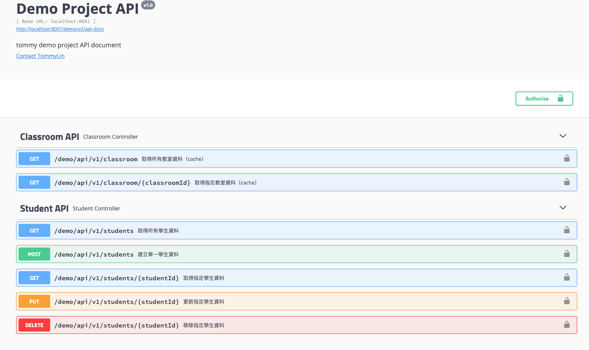

# Sping_Boot_Demo

## Requirements
* docker ( [install here](https://docs.docker.com/desktop/#download-and-install) )

## Get start
1. clone the project  
```bash
$ git clone https://github.com/TommyLin81/Sping_Boot_Demo.git
$ cd demo_test
```
2. build and run docker container
```bash
$ bash start.sh
or
$ docker-compose up -d
```

## Demo project
When docker container started, demo feature using swagger API document  
url: http://localhost:8001/demo/swagger-ui.html  



## Directory structure
```
├── docker
├── logs 
└── src
   ├── main
   │   ├── java
   │   │   ├── com.example.demo_test
   │   │   │   ├── bean 
   │   │   │   ├── config
   │   │   │   ├── controller
   │   │   │   ├── dao
   │   │   │   ├── exception // error handler && custom exception
   │   │   │   └── service
   │   │   └── db.migration
   │   │
   │   └── resources
   │       ├── db.migration
   │       ├── static
   │       └── templates
   │
   └── test
       ├── java.com.example.demo_test
       └── resources
```

## Technologies used
1. **Docker** ( virtualization container )
2. **Spring Data JPA** ( ORM library )
3. **Flyway** ( DB migration library )
4. **Redis** ( in-memory storage )
6. **Swagger** ( API document )
7. **JUnit** ( unit test library )
